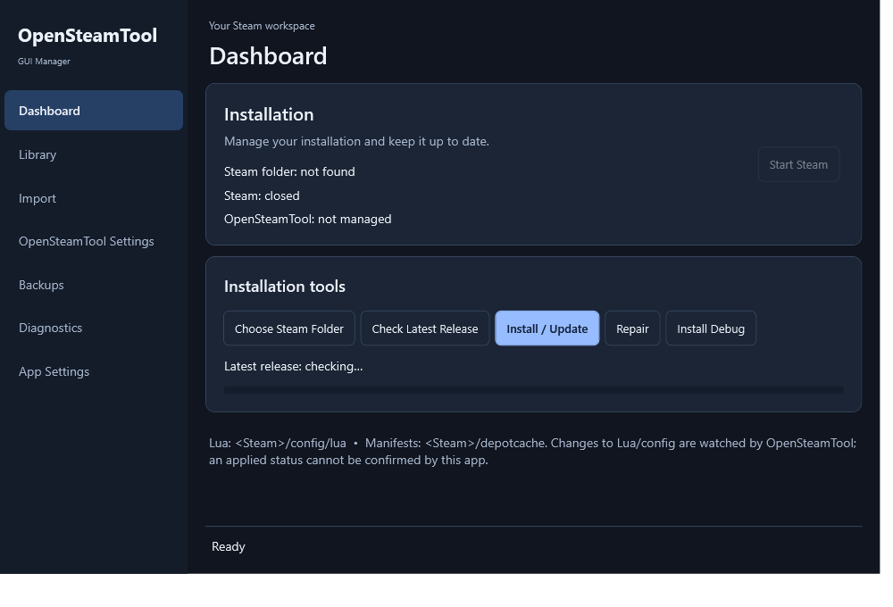
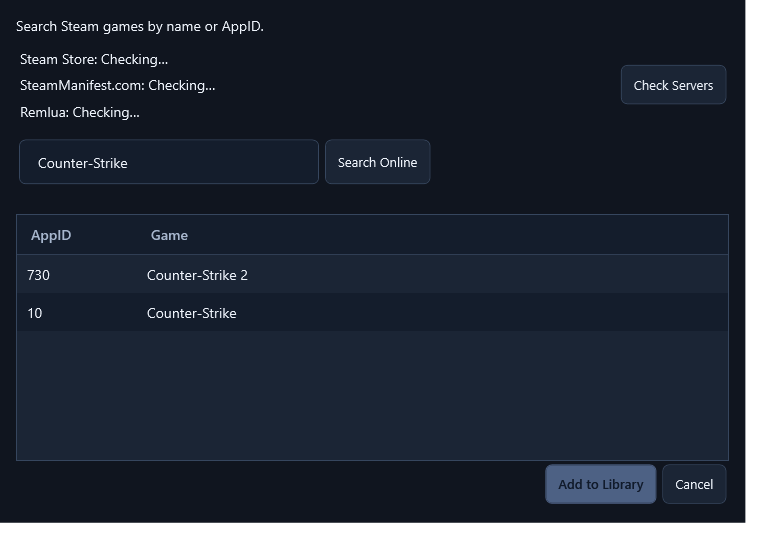

# OpenSteamTool GUI

An unofficial Windows 10/11 x64 desktop manager for the official [OpenSteamTool](https://github.com/OpenSteam001/OpenSteamTool) releases. It installs and updates upstream DLLs, manages Lua and manifest files, and keeps backups of changes it makes.

## Download

Get the latest build from [Releases](https://github.com/muhammetaliaydin/OpenSteamToolGUI/releases). Both ZIPs contain one `OpenSteamToolGUI.exe`:

- **Portable:** includes .NET 10.
- **Lightweight:** requires the [.NET 10 Desktop Runtime](https://dotnet.microsoft.com/download/dotnet/10.0).

Extract a ZIP and run the EXE. The interface starts in English; App Settings offers nine other languages and Dark, Light, or System appearance.
App updates keep your chosen build type: lightweight installations download the lightweight ZIP, and portable installations download the portable ZIP. The lightweight build still requires the .NET 10 Desktop Runtime after an update.

## Screenshots

Dashboard in English (offline preview):

Game finder in English (illustrative sample results; server status was not checked):

## Use

1. Select the Steam folder containing `steam.exe` if it is not detected automatically.
2. Close Steam before installing, updating, repairing, or uninstalling OpenSteamTool DLLs.
   The Dashboard button below **Start Steam** can disable or enable an installed OpenSteamTool while Steam is closed. Disabling restores any original DLLs and keeps the managed DLLs in backups for re-enabling; it does not remove Lua, manifests, or the managed installation. Enable it again before updating or uninstalling.
3. Review file destinations and conflicts before importing a ZIP, Lua file, or manifest. Existing files are kept unless you choose to replace them.

In Library, **Find Games Online** searches Steam Store and SteamManifest.com and shows connectivity for both services and Remlua. Select a game and choose **Add to Library** to fetch available Lua and manifest files from Remlua or SteamManifest.com. Review the import preview and confirm before the app writes files. Steam Store provides search data only; the app does not invent depot IDs or manifest files. Availability depends on the selected game and third-party servers.

The app can back up and restore managed file changes. Saving a file does not confirm that Steam or OpenSteamTool applied it. For version-specific behavior, see [COMPATIBILITY.md](COMPATIBILITY.md).

## Build

Run `powershell -ExecutionPolicy Bypass -File .\build.ps1`. The script uses the .NET 10 SDK and creates portable and lightweight ZIPs in `dist/`; each contains one EXE.

## License

The GUI is licensed under [MIT](LICENSE). OpenSteamTool and other third-party components retain their own licenses.

## Disclaimer

This is an unofficial project, not affiliated with or endorsed by Valve or the OpenSteamTool maintainers. Use it only with software, accounts, and files you are authorized to manage, and follow applicable laws, platform terms, and third-party licenses. The app changes files in a Steam installation; keep independent backups. It is provided "as is" without warranty or liability to the extent permitted by law. Saving a file does not prove that Steam applied it.
